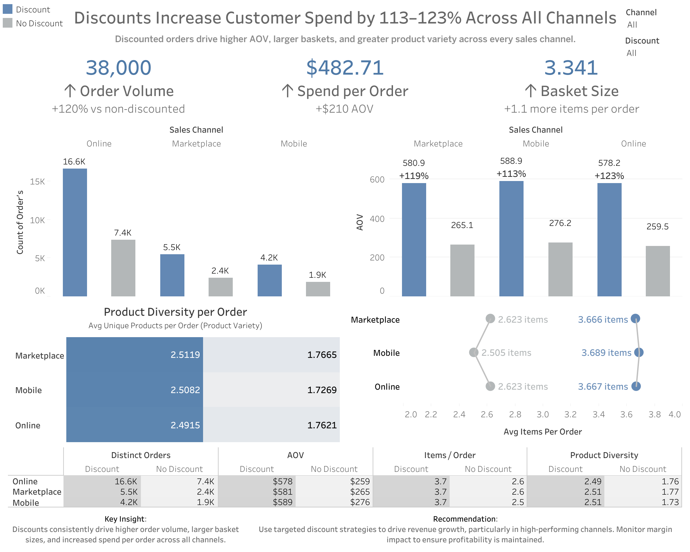

# 📊 Discount Impact on Customer Behavior

## 📌 Overview

This project analyzes how discount strategies influence customer purchasing behavior across three primary sales channels:

- Marketplace  
- Mobile App  
- Online Store  

Rather than focusing on tools or visual design alone, this analysis is centered around a clear business question:

👉 **Do discounts meaningfully change how customers behave and spend?**

---

## 🎯 Business Objective

Understand whether discounting:
- Increases order volume  
- Impacts average order value (AOV)  
- Influences basket size (items per order)  
- Encourages broader product selection  

The goal is to evaluate whether discounts drive **true revenue growth**, not just conversions.

---

## 📈 Key Metrics Defined

Before performing analysis, key KPIs were defined:

- **Orders** → Number of unique transactions  
- **Revenue** → Total sales generated  
- **AOV (Average Order Value)** → Revenue per order  
- **Items per Order** → Average quantity of items purchased per transaction  
- **Product Diversity** → Number of unique products per order  

---

## 🔍 Key Findings

The analysis revealed consistent behavioral changes across all sales channels:

### 🚀 Orders
- Increased by ~120% when discounts were applied  
- Discounts significantly boosted transaction volume  

### 💰 Average Order Value (AOV)
- Increased by $200+ on discounted orders  
- Customers spent more per transaction, not less  

### 🛒 Basket Size (Items per Order)
- Increased by approximately 1 additional item per order  
- Discounts encouraged customers to purchase more items  

### 🧩 Product Diversity
- Higher number of unique products per order  
- Customers explored and purchased a wider range of products  

---

## 🧠 Key Insight

👉 Discounts do not just increase conversions — they fundamentally change purchasing behavior.

Customers:
- Spend more  
- Buy more items  
- Explore more products  

This leads to **larger baskets and higher overall revenue per transaction**.

---

## ⚠️ Business Consideration

While discounts drive strong performance across all key metrics:

👉 **Margin impact must be evaluated**

Higher revenue does not necessarily mean higher profit.  
Future analysis should assess:
- Profit margins  
- Discount depth vs return  
- Long-term customer value  

---

## 📊 Dashboard

🔗 **View Interactive Tableau Dashboard:**  
https://public.tableau.com/app/profile/omar.muniz/viz/customer_behavior_17754093755820/Dashboard1?publish=yes

---

## 🧰 Tools Used

- **SQL** → Data exploration and aggregation  
- **Tableau** → Data visualization and dashboard development  

---

## 📁 Repository Structure

- `/sql/` → SQL queries used for analysis  
- `/assets/` → Dashboard screenshots and visuals  
- `README.md` → Project overview and insights  

---

## 💡 Project Approach

This project follows a business-focused analytics framework:

- Define KPIs before writing queries  
- Focus on answering real business questions  
- Prioritize insights over tools  
- Communicate findings clearly and concisely  

---
